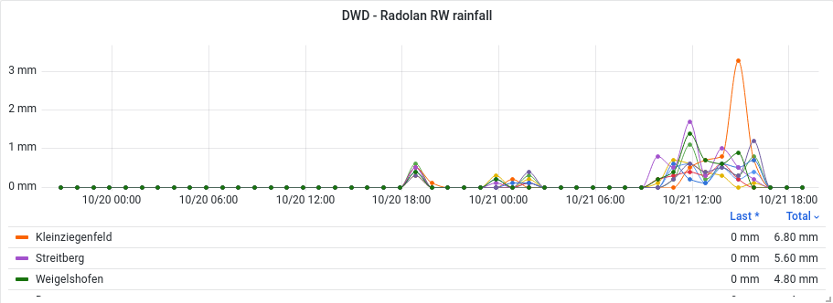

# Radoflux

`radoflux` is a python tool for creating rainfall time-series.

## Description

The
[Radolan](https://www.dwd.de/DE/leistungen/radolan/radolan_info/home_freie_radolan_kartendaten.html)
service operated by german [DWD](https://www.dwd.de/EN/) provides rainfall
measurements for germany. The `radoflux` tool can be used to download the files provided
by this service, select rainfall for a list of geo-locations and feed this data to
a [InfluxDB](https://github.com/influxdata/influxdb) time-series server.



## Configuration

```
cp radoflux.yaml.example radoflux.yaml
```

Edit `radoflux.yaml` to configure infuxdb connection and locations.

## Usage

```
usage: radoflux [-h] [-c CONFIG] [-n NUM_HOURS]

feed radolan data into influxdb

optional arguments:
  -h, --help            show this help message and exit
  -c CONFIG, --config CONFIG
                        path to configuration file
  -n NUM_HOURS, --num-hours NUM_HOURS
                        number of hours to process
```

For initial import you may select eg. last 30 days (30*24=720) for import:

```
radoflux -n 720
```

And then keep it up to date with cron:

```
@hourly radoflux
```

## License

MIT License

Copyright (c) 2022 Markus Benning

Permission is hereby granted, free of charge, to any person obtaining a copy
of this software and associated documentation files (the "Software"), to deal
in the Software without restriction, including without limitation the rights
to use, copy, modify, merge, publish, distribute, sublicense, and/or sell
copies of the Software, and to permit persons to whom the Software is
furnished to do so, subject to the following conditions:

The above copyright notice and this permission notice shall be included in all
copies or substantial portions of the Software.

THE SOFTWARE IS PROVIDED "AS IS", WITHOUT WARRANTY OF ANY KIND, EXPRESS OR
IMPLIED, INCLUDING BUT NOT LIMITED TO THE WARRANTIES OF MERCHANTABILITY,
FITNESS FOR A PARTICULAR PURPOSE AND NONINFRINGEMENT. IN NO EVENT SHALL THE
AUTHORS OR COPYRIGHT HOLDERS BE LIABLE FOR ANY CLAIM, DAMAGES OR OTHER
LIABILITY, WHETHER IN AN ACTION OF CONTRACT, TORT OR OTHERWISE, ARISING FROM,
OUT OF OR IN CONNECTION WITH THE SOFTWARE OR THE USE OR OTHER DEALINGS IN THE
SOFTWARE.
